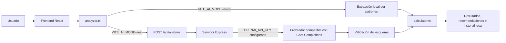
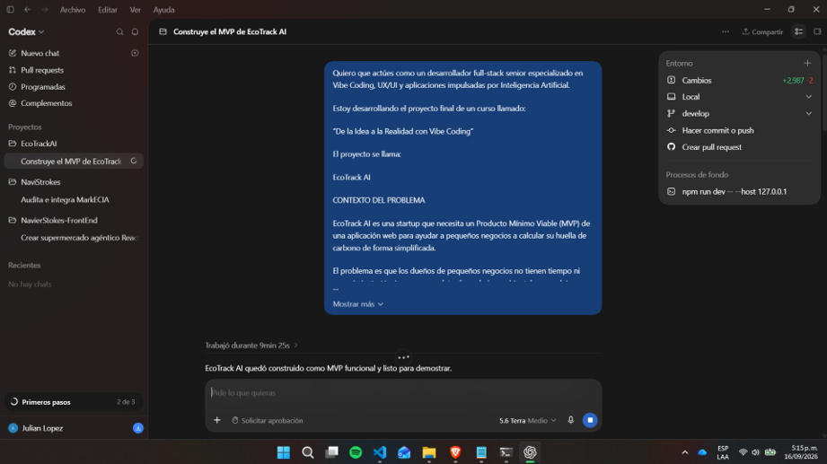
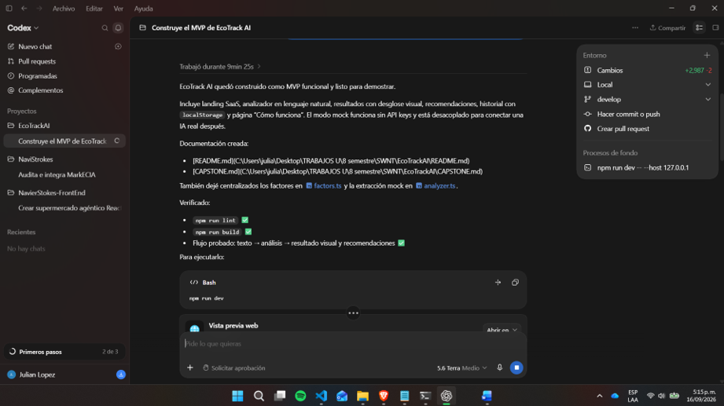
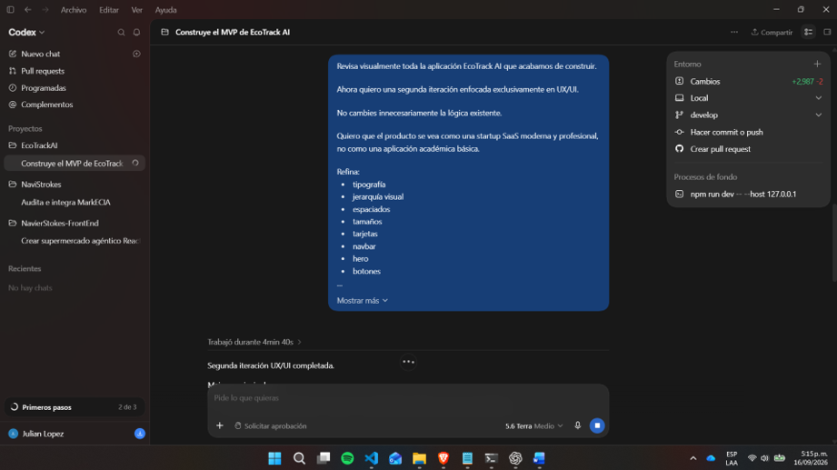
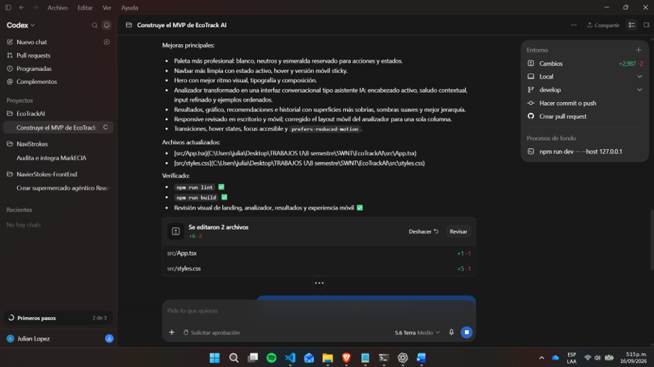
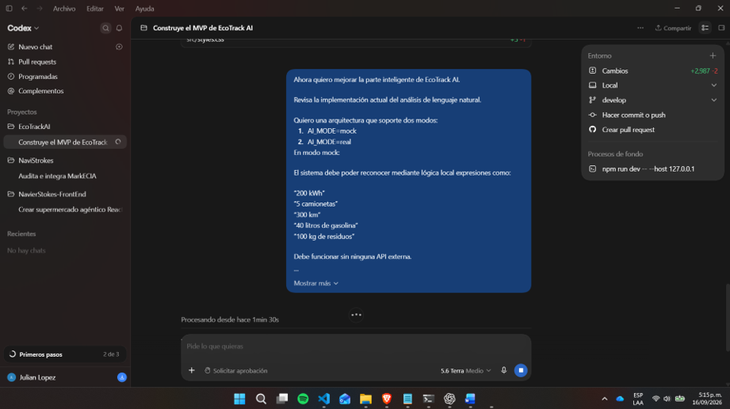
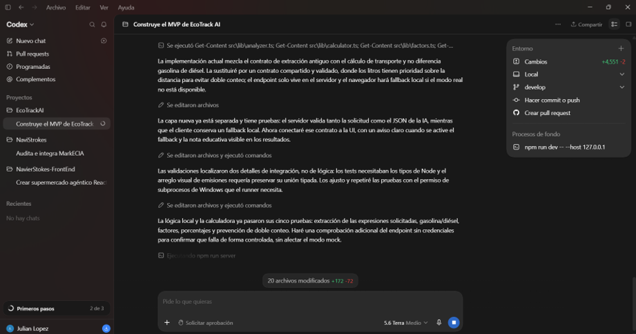
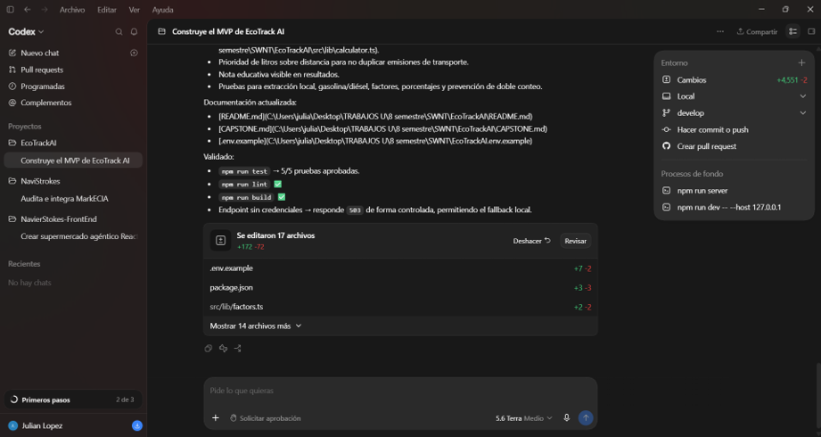

# EcoTrack AI

## Proyecto Integrador Capstone: De la Idea a la Realidad con Vibe Coding

### 1. Introducción

EcoTrack AI es un Producto Mínimo Viable (MVP) web orientado a pequeños negocios que quieren obtener una estimación inicial de su huella de carbono. El proyecto busca reducir la complejidad de la primera medición: en vez de completar formularios técnicos, la persona puede escribir una descripción de sus actividades operativas.

La aplicación interpreta esa información, aplica factores de emisión simplificados y presenta un resultado visual con recomendaciones. El alcance es educativo y orientativo; no constituye una certificación ambiental oficial.

### 2. Problema identificado

Para un pequeño negocio, actividades como consumir electricidad, realizar entregas o generar residuos son parte de la operación cotidiana. Sin embargo, traducirlas a emisiones suele requerir tiempo, conocimiento técnico y formularios que no están adaptados a la forma en que una persona describe su trabajo diario.

Desde la perspectiva del usuario, el problema no es necesariamente la ausencia total de datos, sino que estos se encuentran dispersos o se expresan de manera informal: “usamos cinco camionetas”, “gastamos 200 kWh” o “generamos residuos”. EcoTrack AI plantea una primera experiencia de medición más accesible a partir de ese lenguaje cotidiano.

### 3. Propuesta de solución

EcoTrack AI implementa el siguiente flujo:

```text
Usuario describe sus actividades
        ↓
EcoTrack AI interpreta la información
        ↓
Extrae datos relevantes
        ↓
Calcula una estimación
        ↓
Presenta resultados visuales
        ↓
Genera recomendaciones básicas
```

La interfaz incluye una landing, un analizador conversacional, una vista de resultados, un historial local y una página que explica el funcionamiento. Los análisis se guardan en `localStorage` del navegador, sin autenticación ni base de datos.

### 4. Objetivo del MVP

El MVP busca demostrar que es posible convertir una descripción sencilla de las actividades de un negocio en una estimación entendible de emisiones. La demostración se centra en tres capacidades: extracción básica de datos, cálculo transparente con factores configurables y presentación visual de la fuente principal de impacto.

No busca sustituir una auditoría, inventario de gases de efecto invernadero ni reporte regulatorio. Su propósito es facilitar una primera conversación y ayudar a identificar oportunidades de mejora.

### 5. Público objetivo

La aplicación está dirigida a propietarios o responsables de pequeños negocios que no son especialistas ambientales. Los ejemplos y secciones de la interfaz mencionan contextos como pequeños comercios, restaurantes, servicios locales y logística de entrega.

El producto está pensado para personas que conocen sus actividades operativas, pero que necesitan una manera más simple de transformarlas en una señal inicial sobre su impacto.

### 6. Definición del “Vibe”

La personalidad de EcoTrack AI se definió como amigable, moderna, ecológica, tecnológica y no técnica. La experiencia intenta que el análisis se sienta como conversar con un asistente, no como diligenciar un formulario ambiental.

El tono usa verbos sencillos y recomendaciones directas. En UX se priorizan la jerarquía visual, los estados de carga, mensajes de validación, espacios amplios, navegación clara y una vista responsive. La interfaz incluye foco visible para teclado y una regla para reducir animaciones cuando el sistema del usuario así lo solicita.

La identidad visual usa superficies blancas y tonos neutros con verde esmeralda para acciones, estado activo e iconografía de sostenibilidad. El panel del analizador concentra el carácter visual: presenta un encabezado de asistente, un mensaje contextual y un área de escritura con ejemplos, para hacer más clara la interacción principal.

### 7. Master Prompt

El siguiente prompt orientó la construcción inicial del proyecto:

```text
Construye EcoTrack AI, una experiencia SaaS mobile-first para pequeños negocios.
Debe convertir descripciones de actividades en lenguaje natural en una estimación
educativa de emisiones, explicar visualmente la fuente principal y sugerir acciones
simples. Usa una identidad ecológica, moderna, confiable y no técnica. Mantén la
extracción, el cálculo y la presentación desacoplados; si no hay credenciales,
usa un simulador completamente funcional.
```

### 8. Tecnologías y herramientas utilizadas

| Tecnología/Herramienta | Uso |
| --- | --- |
| React | Construcción de la interfaz y manejo de las vistas de la SPA. |
| TypeScript | Tipado de análisis, datos extraídos, cálculos y componentes. |
| Vite | Servidor de desarrollo, compilación del frontend y proxy de `/api` durante desarrollo. |
| CSS propio | Diseño responsive, estilos visuales, estados de foco, transiciones y reducción de movimiento. |
| lucide-react | Iconografía de interfaz y sostenibilidad. |
| Express | Endpoint server-side `POST /api/analyze` para el modo de IA real. |
| `fetch` nativo | Comunicación del cliente con el endpoint y del servidor con una API compatible con Chat Completions. |
| localStorage | Persistencia local de hasta diez análisis recientes. |
| ESLint | Revisión estática del código. |
| Node test runner + tsx | Ejecución de pruebas de extracción y cálculo. |

### 9. Arquitectura de la solución

La aplicación separa presentación, extracción y cálculo. El frontend no recibe ni almacena una clave de API. El modo real solo se activa con variables de entorno y un servidor local configurado.



Los archivos principales son:

- `src/App.tsx`: concentra las vistas, navegación interna y guardado del historial.
- `src/lib/analyzer.ts`: selecciona el modo mock o real y contiene el fallback local.
- `src/lib/schema.ts`: valida el contrato de extracción antes de usar datos externos.
- `server/index.ts`: recibe texto, consulta un proveedor en modo real y responde JSON validado.
- `src/lib/calculator.ts`: genera total, desglose, porcentajes y fuente principal.
- `src/lib/factors.ts`: contiene los factores simplificados en un solo lugar.

### 10. Análisis de lenguaje natural e IA

El modo que funciona sin servicios externos es `VITE_AI_MODE=mock`. Utiliza expresiones regulares y un pequeño diccionario de números escritos para reconocer valores como `200 kWh`, `5 camionetas`, `300 km`, `40 litros de gasolina`, `25 litros de diésel` y `100 kg de residuos`. También reconoce algunos números escritos, por ejemplo “dos vehículos”. Este modo devuelve actividades adicionales como un arreglo vacío; no realiza comprensión semántica general.

El proyecto también implementa la arquitectura para `VITE_AI_MODE=real`. En ese caso el cliente consulta `/api/analyze` y Vite redirige esa ruta a Express durante el desarrollo. El servidor requiere `AI_MODE=real` y `OPENAI_API_KEY`; además permite configurar `OPENAI_MODEL` y `OPENAI_BASE_URL`. La clave se usa únicamente en `server/index.ts`.

El endpoint solicita una respuesta JSON estructurada con electricidad, vehículos, distancia, litros de gasolina, litros de diésel, residuos, actividades adicionales y confianza. `validateExtraction` rechaza respuestas con tipos inválidos, números negativos, confianza fuera del rango de 0 a 1 o actividades adicionales mal formadas. Si el servicio no está disponible o su respuesta no es válida, el cliente utiliza el analizador local como fallback.

En el repositorio no hay una clave configurada ni se documenta una llamada exitosa a un proveedor real. Por tanto, la integración real está preparada y validada a nivel de código, pero no forma parte de la demostración funcional sin configuración externa.

### 11. Cálculo de emisiones y factores

Los factores están centralizados en `src/lib/factors.ts` y son modificables sin cambiar la interfaz. El cálculo usa los siguientes valores simplificados:

| Fuente | Factor implementado |
| --- | ---: |
| Electricidad | 0.42 kg CO₂e por kWh |
| Gasolina | 2.31 kg CO₂e por litro |
| Diésel | 2.68 kg CO₂e por litro |
| Distancia vehicular sin combustible directo | 0.25 kg CO₂e por km |
| Residuos | 0.45 kg CO₂e por kg |

La salida interna del cálculo contiene `total_co2e_kg`, un desglose de electricidad, transporte y residuos, porcentajes y `main_source`. Para transporte, los litros de gasolina o diésel tienen prioridad. Si existen litros y kilómetros en el mismo texto, no se suma la estimación por distancia para evitar doble conteo.

La pantalla de resultados muestra de forma visible la nota: “Esta estimación utiliza factores simplificados y tiene fines educativos y orientativos.”

### 12. Funcionalidades implementadas

- Landing con navegación, hero, pasos, beneficios, CTA y footer.
- Analizador con textarea, ejemplos seleccionables, validaciones y estado de carga.
- Extracción local de datos ambientales y modo real preparado por endpoint.
- Resultado con huella estimada, fuente principal, barras de desglose y recomendaciones.
- Historial local de análisis recientes con acceso a cada resultado.
- Página “Cómo funciona” con explicación del proceso y su alcance.
- Diseño responsive para escritorio y móvil.
- Pruebas básicas de lógica de extracción y cálculo.

### 13. Desarrollo Iterativo con Vibe Coding

El desarrollo de EcoTrack AI se construyó mediante iteraciones guiadas por las instrucciones en lenguaje natural del proyecto. A continuación se documentan los prompts recibidos y el resultado implementado en cada caso.

#### Iteración 1 — Construcción inicial

Prompt utilizado:

> Quiero que actúes como un desarrollador full-stack senior especializado en Vibe Coding, UX/UI y aplicaciones impulsadas por Inteligencia Artificial. Estoy desarrollando el proyecto final “De la Idea a la Realidad con Vibe Coding”. El proyecto se llama EcoTrack AI.
>
> Construir una aplicación web funcional donde el usuario pueda describir las actividades de su negocio mediante una interfaz tipo chat o formulario inteligente; el sistema analice el texto automáticamente; identifique consumo eléctrico, vehículos, kilómetros, combustible y residuos; genere una estimación aproximada de emisiones CO₂ equivalente; muestre un resumen visual y recomendaciones básicas.
>
> Crea como mínimo: Landing Page, Analizador de huella de carbono, Resultado del análisis, Historial o dashboard básico y página “Cómo funciona”. Analiza primero el repositorio actual. Si está vacío, crea el proyecto usando una arquitectura moderna y simple. Preferiblemente React, TypeScript, Tailwind CSS y componentes reutilizables. Después ejecuta lint, build y verifica el flujo principal.

Resultado implementado:

- Creación de una SPA con React, TypeScript y Vite.
- Landing, analizador, resultados, historial y página “Cómo funciona”.
- Interfaz de escritura en lenguaje natural con ejemplos, validaciones y estado de carga.
- Persistencia de hasta diez análisis recientes en `localStorage`.
- Cálculo educativo básico, desglose visual y recomendaciones por fuente principal.

#### Iteración 2 — Refinamiento visual

Prompt utilizado:

> Revisa visualmente toda la aplicación EcoTrack AI que acabamos de construir. Ahora quiero una segunda iteración enfocada exclusivamente en UX/UI. No cambies innecesariamente la lógica existente.
>
> Quiero que el producto se vea como una startup SaaS moderna y profesional, no como una aplicación académica básica. Refina tipografía, jerarquía visual, espaciados, tamaños, tarjetas, navbar, hero, botones, inputs, interfaz del analizador, pantalla de resultados, dashboard, gráficos, estados de carga y responsive.
>
> Mantén el concepto ecológico pero evita abusar del verde. Utiliza principalmente blanco, tonos neutros y verde esmeralda como color de acento. Haz que escribir “Hoy usamos 5 camionetas y gastamos 200 kWh de electricidad” se sienta similar a interactuar con un asistente de IA moderno. Mantén accesibilidad y buen contraste. Después de los cambios ejecuta build y lint y corrige cualquier problema.

Resultado implementado:

- Refinamiento hacia superficies blancas y neutras con verde esmeralda reservado para acciones y estados.
- Mejora de navbar, hero, tarjetas, botones, gráficos, hover states y transiciones.
- Rediseño del analizador como panel conversacional con encabezado de asistente, estado “En línea”, mensaje contextual y ejemplos.
- Ajuste responsive específico para que el analizador se presente en una sola columna en móvil.
- Regla CSS para respetar `prefers-reduced-motion` y foco visible para navegación por teclado.

#### Iteración 3 — Funcionalidad inteligente y cálculo

Prompt utilizado:

> Ahora quiero mejorar la parte inteligente de EcoTrack AI. Quiero una arquitectura que soporte dos modos: `AI_MODE=mock` y `AI_MODE=real`.
>
> En modo mock, el sistema debe poder reconocer mediante lógica local expresiones como “200 kWh”, “5 camionetas”, “300 km”, “40 litros de gasolina” y “100 kg de residuos”. En modo real, crea un endpoint backend/server-side preparado para utilizar una API de IA mediante una variable de entorno. Nunca expongas la API key al navegador. La IA debe recibir el texto del usuario y devolver JSON estructurado. Valida la respuesta antes de utilizarla. Si la API falla, no debe romper la aplicación y utiliza fallback al modo local cuando sea apropiado.
>
> Revisa la calculadora actual de emisiones. Centraliza todos los factores de emisión en un único archivo. Calcula electricidad, gasolina, diésel, distancia vehicular cuando no existe combustible directo y residuos. Evita contar dos veces una misma fuente. Incluye una nota visible sobre factores simplificados y fines educativos. Agrega pruebas básicas para validar la lógica de cálculo.

Resultado implementado:

- Extracción local por patrones para electricidad, vehículos, distancia, gasolina, diésel y residuos; incluye reconocimiento de algunos números escritos.
- Implementación de `VITE_AI_MODE=mock` y arquitectura para `VITE_AI_MODE=real`.
- Endpoint Express `POST /api/analyze`, variables de entorno server-side y validación del JSON estructurado.
- Fallback al análisis local cuando falla la consulta remota o su respuesta no cumple el esquema.
- Factores centralizados, total, desglose, porcentajes, fuente principal y regla que prioriza litros sobre distancia para no duplicar emisiones.
- Cinco pruebas automatizadas para extracción y cálculo; su última ejecución registrada finalizó sin fallos.

### 14. Validación realizada

El repositorio incorpora cinco pruebas automatizadas. Dos validan la extracción local de medidas, incluyendo cantidades escritas y diésel. Tres validan la calculadora: desglose con electricidad, gasolina y residuos; prioridad de combustible sobre distancia; y estimación por distancia cuando no se indican litros.

Durante la implementación se ejecutaron los scripts disponibles del proyecto:

```bash
npm run test
npm run lint
npm run build
```

La última ejecución registrada de pruebas tuvo cinco pruebas aprobadas, sin fallos. Lint y build también finalizaron correctamente.

### 15. Limitaciones actuales

- Los factores de emisión son fijos y educativos; no están regionalizados ni validados para certificación.
- El modo mock reconoce patrones concretos, no todos los modos posibles de expresar una actividad.
- No existe autenticación, base de datos ni sincronización entre dispositivos; el historial depende del navegador.
- El modo real requiere que la persona que despliega el proyecto configure una clave y un proveedor compatible. Esa configuración no está incluida en el repositorio.
- Las actividades adicionales están incluidas en el contrato de IA, pero la calculadora actual no las convierte en emisiones.

### 16. Conclusión

EcoTrack AI demuestra un flujo completo y presentable para una primera estimación de impacto: partir de una descripción natural, extraer datos básicos, calcular un resultado educativo y mostrar acciones de mejora. El trabajo combina una experiencia visual orientada a pequeños negocios con una estructura técnica que deja separados el análisis, los factores y la presentación.

Como siguiente evolución, sería necesario incorporar factores regionales, una fuente de datos persistente y una integración de IA real configurada en un entorno seguro. Estos pasos ampliarían el alcance del MVP sin cambiar la idea central: hacer que la primera aproximación a la huella de carbono sea más accesible.

### 17. Link Despliegue

https://ecotrack-ai-lovat.vercel.app/

### 18. Link Video 

https://youtu.be/_yaQWU6RZOA


### 19. Evidencias 














